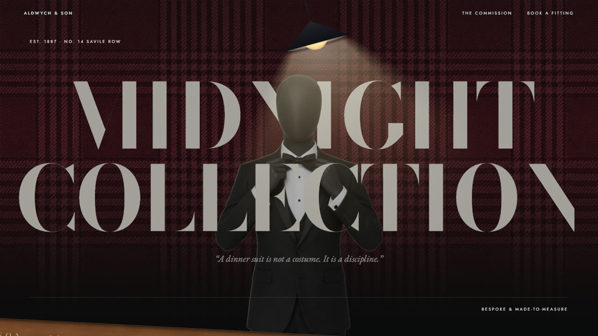
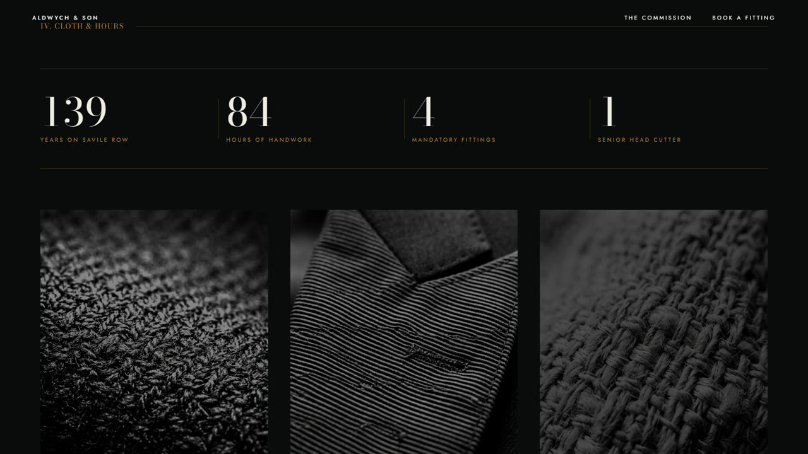
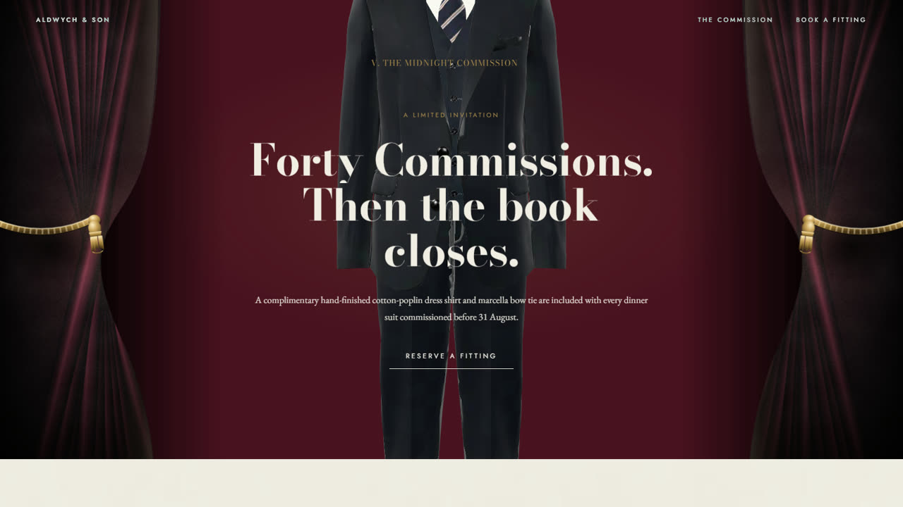

<div align="center">



<br /><br />

### A L D W Y C H &nbsp;&amp;&nbsp; S O N

**Est. 1887 · No. 14 Savile Row**

<sub>*“A dinner suit is not a costume. It is a discipline.”*</sub>

<br />


</div>

<br />

A single-page site for a fictional Savile Row house. Seven sections, each cut
to its own pattern — a horizontal run under a pin, a film scrubbed by the
scroll, cloth that only shows its weave where light rakes across it, and a
stage whose drapes are drawn in CSS rather than photographed.

---

## The order of things

| | Section | Ground | What it does |
|---|---|---|---|
| | **Hero** | ink | Sticky, so the manifesto rises over it rather than the two leaving together |
| **I** | **Manifesto** | ivory | The house's terms, over a leather divider |
| **II** | **Anatomy of the Suit** | ink | A film with the playhead on the scroll, not the clock. Captions change as the camera arrives on each detail |
| **III** | **The Collection** | ivory | Three suits on a horizontal track under a pin. At its end the page splits down its centre line and the halves travel off opposite edges |
| **IV** | **Cloth & Hours** | ink | The copy says the weave is legible only where light rakes across the pile, so the section does exactly that — an over-exposed copy of each swatch, masked to a pool at the pointer |
| **V** | **The Midnight Commission** | oxblood | A 3D figure behind velvet drapes. Every fold, the nap, the cord and its tassel are CSS and SVG |
| **VI** | **Testimony** | ivory | A looping film behind the quotes, started on arrival and paused on the way out |
| **VII** | **Heritage** | ink | 1887 → 2026, counted from a date rather than hard-coded |

<br />

<div align="center">
  
  
</div>

---

## Running it

```bash
npm install
npm run dev          # → http://localhost:3000
```

> **If your checkout path contains an `&`**, `npm run dev` will fail with
> `Cannot find module ...\vite\bin\vite.js`. npm shells out through `cmd.exe`,
> which reads the `&` as a command separator and truncates the path. Bypass the
> shim:
>
> ```bash
> node ./node_modules/vite/bin/vite.js --port=3000 --host=0.0.0.0
> ```

`npm run build` for a production bundle, `npm run lint` to typecheck.

---

## How it is put together

**The page is `index.html`.** All of it — markup, styles and behaviour. `src/`
is a Vite stub totalling nineteen lines and renders nothing; it is there
because the project was scaffolded from a React template and never grew into
one.

Everything served lives in `public/` — Vite only copies that directory into
`dist`, so an asset sitting in the project root will work in dev and 404 in
production.

Motion is **GSAP + ScrollTrigger**, with **Lenis** smoothing the scroll. The
3D figure is Google's `<model-viewer>`. Nothing else is a dependency;
`@google/genai` and `GEMINI_API_KEY` in `.env.example` are leftovers from the
scaffold and are referenced nowhere.

---

## On performance

The page is heavy by nature — a 3D model, four films, full-bleed imagery — so
the work went into not paying for any of it twice. Measured by frame timing
under real wheel input, section by section:

| | before | after |
|---|---|---|
| Worst-section p95 frame | 24.4 ms | **6.8 ms** |
| Worst single frame | 87.4 ms | **25.5 ms** |
| Dropped frames | up to 12.9% | **0%** |

What actually mattered, in order:

- **The hero never stopped drawing.** It is sticky so the manifesto can rise
  over it, but the sticky never releases — a full-viewport layer with a 776 KB
  image, a masked gradient and a canvas stayed composited under every section
  for the whole page. It now sleeps once covered.
- **Fifty-two animations ran from load**, whether or not the commission was
  within a screen. They idle off-section now.
- **`auto-rotate` on the model cost 44 fps**, because it redraws the scene
  every frame forever. The figure turns with the scroll instead, so an idle
  page costs nothing.
- **The model was 33.1 MB.** Draco, WebP textures and mesh simplification took
  it to **1.02 MB**. The simplification is a payload saving only — measured, it
  made no difference to frame rate, because the model is fill-rate bound.
- **Blend modes on the drapes cost 27.8 fps** and a sub-pixel blur another
  19.4. Both went; straight alpha and the gradients' own soft stops carry it.

Everything above degrades under `prefers-reduced-motion`: films do not play,
drapes hang still, the split does not run.

---

<div align="center">
<sub>Aldwych &amp; Son is fictional. Prices, provenance and press are invented.</sub>
</div>
